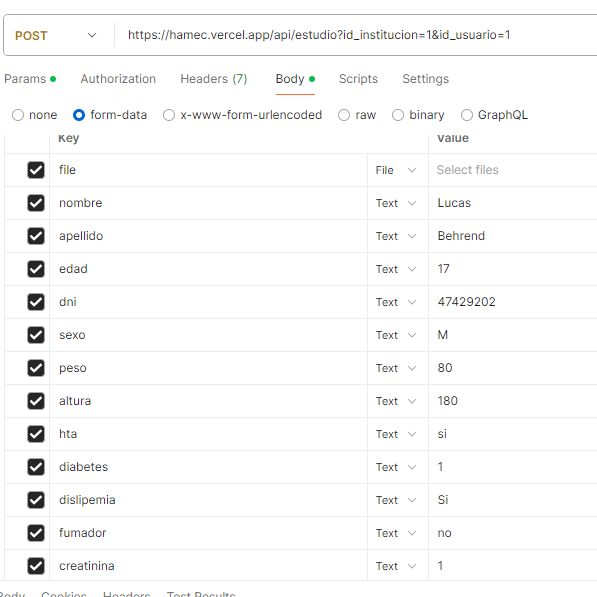
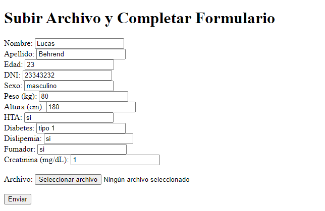

Grupos con los que hable: DEIA, IACM y HAMEC

1. Hacer mis propias funciones de normalización:

    ```
    function check_sexo(sexo){
        if(sexo.toLowerCase()[0] == 'm'){
            return 'sexo', 'M';
        }    
        else{
            return('sexo', 'F');
        }
    }
    ```

    Esto lo hice porque el front de Hamec permite ingresar texto, pero su back lee valores específicos en el form data.

2. Copiar la normalizacion de hamec

    ```
     if (body.sexo === 'Masculino' || body.sexo === 'M' || body.sexo === 'm' || body.sexo === 'masculino') {
            form.set('sexo', 'M');
        }
        else {
            form.set('sexo', 'F');
        }
    ```
    Como lo anterior no andaba, copie la normalización de Hamec.

3. Axios y fetch para envíar la request
    Probé tanto Axios como fetch para la post request por si ese era el problema
4. Mandar el file directo en el form data
    ```
    formData.set('file', file);
    ```
    Esto fue la primera forma que intente mandar el archivo.
5. Librería form-data
    ```
    import FormData from 'form-data';
    ...
    let form = new FormData();
    ```
    Como mi servidor no es directo del front, había que instalar la libreria para manejar form-datas.
6. File.buffer
    ```
    formData.set('file', file.buffer);
    ```
    Multer permite acceder al buffer de los archivos, probé mandarlo en el form-data pero devolvía error.
7. fs.readstream
    ```
    const fileStream = streamifier.createReadStream(file.buffer);
    formData.append('file', fileStream);
    ```
    Probé mandar un stream en vez de un buffer pero devolvía que el servidor estaba intentando editar un archivo read-only.
8. Postman

    Para ver si una request normal andaba probé postman.
9. REST
    ```
    POST http://localhost:3000/electrocardiograma
    Content-Type: application/json

    {
        "nombre": "Lucas",
        "apellido": "Behrend", 
        "edad": "23",
        "dni": "23343232",
        "sexo": "masculino",
        "peso": "80",
        "altura": "180",
        "hta": "si",
        "diabetes": "tipo 1",
        "dislipemia": "si",
        "fumador": "si"

    }```

    Junto con postman intenté un archivo .REST
    
10. Envíar desde un front.
    

