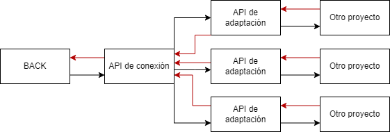

Esta parte del proyecto se encarga de conectar el backend con los otros proyectos.
Consiste de una API principal que envíe y reciba datos, y APIs individuales personalizadas para cada proyecto.

Un archivo init que utilice funciones en otros archivos para mas ordenado.
La api principal, toma los datos que recibe, y los distribuye a la api de adaptación correspondiente.
La api de conexión adapta los datos, ya sea tipo de archivo, de datos, etc.